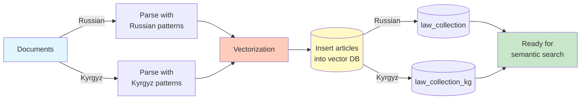
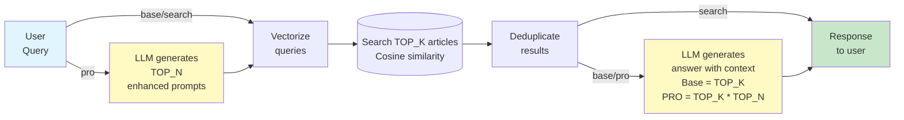
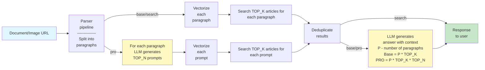
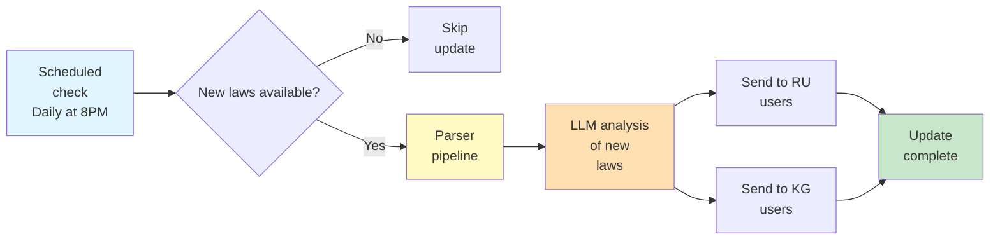

# Law RAG System

[🇷🇺 Русская версия](README.ru.md)

A high-performance Retrieval-Augmented Generation (RAG) system for searching legislation of the Kyrgyz Republic with Telegram bot integration.

## ✨ Features

- **🔍 Semantic search** through legal documents using vector embeddings
- **🤖 Telegram bot** for convenient system interaction
- **📊 Three response modes**:
  - **Basic** (1 request) — fast search + LLM answer
  - **Advanced** (2 requests) — extended analysis with clarifying questions
  - **Search** (1 request) — only relevant articles without LLM
- **🌐 Web frontend (Next.js 16)** with streaming chat, file analysis, themes, and voice mode
- **🧩 REST API (FastAPI)**: all modes available over HTTP with Swagger UI
- **🚀 Unified launcher**: `run_service.py` starts backend + frontend in both dev and prod modes
- **💬 Chat history**: `previous_response_id` support for multi-turn conversations
- **🌐 Bilingual support**: Russian and Kyrgyz
- **📄 Document analysis** with structured data extraction:
  - PDF files via URL (no base64)
  - Images/screenshots of documents
- **⚡ Optimized performance**: singleton patterns, LRU caching, lazy-loading
- **💾 MySQL + Milvus**: user data storage and vector search

## 🏗 Project Architecture

```
law-rag-system/
├── aitools/                      # AI tools
│   ├── embedder.py              # Singleton embedder with caching
│   └── llm.py                   # Azure OpenAI client (responses API)
├── bot/                          # Telegram bot
│   ├── bot.py                   # Bot initialization and launch
│   ├── handlers.py              # Message handlers
│   ├── keyboards.py             # Cached keyboards
│   ├── messages.py              # Localized messages
│   └── states.py                # FSM states
├── confs/                        # Configuration
│   └── config.py                # Environment variables + cached prompts
├── databases/                    # Database operations
│   ├── db.py                    # MySQL (users, balance)
│   ├── milvus_db.py             # Milvus (vector search)
│   ├── milvus_init.py           # Milvus initialization
│   └── init.sql                 # SQL schema
├── parser/                       # Document parsing (OOP)
│   ├── document_parser.py       # DocumentParser (RU/KG support)
│   ├── vectorizer.py            # Vectorizer (embeddings)
│   ├── milvus_loader.py         # MilvusLoader (data loading)
│   ├── pipeline.py              # ParserPipeline (full workflow)
│   ├── docx/                    # Russian DOCX files
│   └── docx_kg/                 # Kyrgyz DOCX files
├── searchers/                    # Search logic
│   └── search.py                # ProLawRAGSearch (RAG pipeline)
├── api/                          # FastAPI application
│   ├── __init__.py
│   └── app.py                   # Endpoints: /v1/query, /v1/query/doc, /v1/query/image
├── frontend/                     # Next.js web frontend
│   ├── src/app/                 # App Router pages and API routes
│   ├── src/components/          # Chat UI, markdown, themes, voice chat
│   └── package.json             # Frontend dependencies and scripts
├── main.py                       # CLI entry point
├── run_bot.py                    # Telegram bot launcher
├── run_api.py                    # FastAPI server launcher
├── run_service.py                # Unified backend + frontend launcher
├── law_rag_db.json              # Law database (RU)
├── law_rag_db_kg.json           # Law database (KG)
├── .env.example                  # Full environment variable template
├── requirements.txt              # Dependencies
└── .env                          # Environment variables
```

## 🚀 Quick Start

### 1. Clone and install dependencies

Requirements:

- Python 3.10+
- Node.js 20+
- npm 10+

```bash
git clone https://github.com/Hanbiike/law-rag-system.git
cd law-rag-system
python3 -m venv venv
source venv/bin/activate
pip install -r requirements.txt
cd frontend
npm install
cd ..
```

If you only need the backend or Telegram bot, the frontend installation step can be skipped.

### 2. Create `.env` from `.env.example`

```bash
cp .env.example .env
```

The repository now includes a complete [.env.example](.env.example) file. The most important variables are:

```env
# Azure OpenAI primary deployment
AZURE_ENDPOINT=https://your-resource.openai.azure.com/
AZURE_OPENAI_API_KEY=your_primary_api_key
AZURE_DEPLOYMENT=your_primary_deployment
AZURE_API_VERSION=2025-03-01-preview

# Azure OpenAI Nano (routing / query expansion)
AZURE_ENDPOINT_NANO=https://your-endpoint.openai.azure.com/
AZURE_OPENAI_API_KEY_NANO=your_api_key
AZURE_DEPLOYMENT_NANO=your_deployment_name
AZURE_API_VERSION_NANO=2025-03-01-preview

# Telegram Bot
TELEGRAM_BOT_TOKEN=your_bot_token

# MySQL (optional, defaults to localhost)
DB_HOST=localhost
DB_USER=root
DB_PASSWORD=root
DB_NAME=law_rag_users
DB_PORT=3306

# Local servers
API_HOST=0.0.0.0
API_PORT=8000
API_WORKERS=1
FRONTEND_PORT=3000
LAW_RAG_API_URL=http://127.0.0.1:8000
NEXT_PUBLIC_DEFAULT_THEME=
```

### 3. Setup MySQL Database

**Install MySQL:**

```bash
# macOS
brew install mysql
brew services start mysql

# Ubuntu/Debian
sudo apt update
sudo apt install mysql-server
sudo systemctl start mysql

# Windows
# Download and install from https://dev.mysql.com/downloads/mysql/
```

**Create Database and User:**

```bash
# Connect to MySQL
mysql -u root -p
```

```sql
-- Create database
CREATE DATABASE law_rag_users CHARACTER SET utf8mb4 COLLATE utf8mb4_unicode_ci;

-- Create user (change password)
CREATE USER 'law_rag_user'@'localhost' IDENTIFIED BY 'your_secure_password';

-- Grant privileges
GRANT ALL PRIVILEGES ON law_rag_users.* TO 'law_rag_user'@'localhost';
FLUSH PRIVILEGES;

-- Exit
EXIT;
```

**Initialize Schema:**

```bash
# Import database schema
mysql -u law_rag_user -p law_rag_users < databases/init.sql
```

**Update `.env` with your credentials:**

```env
DB_HOST=localhost
DB_USER=law_rag_user
DB_PASSWORD=your_secure_password
DB_NAME=law_rag_users
DB_PORT=3306
```

### 4. Launch

**Recommended: start backend + frontend together**
```bash
python run_service.py

# Frontend:  http://localhost:3000
# Backend:   http://localhost:8000/docs

# Production mode (builds frontend and runs standalone server)
python run_service.py --mode prod

# Only frontend or only backend
python run_service.py --no-backend
python run_service.py --no-frontend

# Custom ports
python run_service.py --frontend-port 3001 --api-port 8080
```

Development mode uses `next dev --webpack` for the frontend. Production mode builds the Next.js app and launches the standalone server, while automatically preparing the required static assets.

**Telegram bot:**
```bash
python run_bot.py
```

**FastAPI server only:**
```bash
python run_api.py
# Swagger UI: http://localhost:8000/docs

# Custom host/port
python run_api.py --host 0.0.0.0 --port 8080

# Development mode with auto-reload
python run_api.py --reload
```

**CLI testing:**
```bash
python main.py
```

## 📖 Usage

### REST API (FastAPI)

The HTTP API exposes all search modes and supports chat history via `previous_response_id`.

#### Endpoints

| Method | Path | Description |
|--------|------|-------------|
| `GET` | `/health` | Liveness check |
| `POST` | `/v1/query` | Text query (`base` / `pro` / `search`) |
| `POST` | `/v1/query/doc` | PDF analysis by URL (`base` / `pro`) |
| `POST` | `/v1/query/image` | Image / screenshot analysis by URL (`base` / `pro`) |

#### Text query

```bash
curl -X POST http://localhost:8000/v1/query \
  -H "Content-Type: application/json" \
  -d '{
    "query": "What rights does an employee have upon dismissal?",
    "type": "pro",
    "lang": "ru"
  }'
```

Response:
```json
{
  "response": "According to Article 83 of the Labour Code...",
  "response_id": "resp_abc123",
  "mode": "pro",
  "lang": "ru"
}
```

#### Multi-turn conversation (chat history)

Pass `response_id` from the previous response as `previous_response_id` in the next request:

```bash
curl -X POST http://localhost:8000/v1/query \
  -H "Content-Type: application/json" \
  -d '{
    "query": "What are the exceptions?",
    "type": "pro",
    "lang": "ru",
    "previous_response_id": "resp_abc123"
  }'
```

#### PDF document analysis

```bash
curl -X POST http://localhost:8000/v1/query/doc \
  -H "Content-Type: application/json" \
  -d '{
    "query": "Is this contract legal?",
    "file_url": "https://example.com/contract.pdf",
    "type": "base",
    "lang": "ru"
  }'
```

#### Image / screenshot analysis

```bash
curl -X POST http://localhost:8000/v1/query/image \
  -H "Content-Type: application/json" \
  -d '{
    "query": "Check this document for compliance",
    "image_url": "https://example.com/scan.jpg",
    "type": "base",
    "lang": "ru"
  }'
```

Interactive documentation is available at **http://localhost:8000/docs** (Swagger UI) and **http://localhost:8000/redoc**.

---

### Telegram Bot

After launching the bot, users can:
1. Choose interface language (🇷🇺 Russian / 🇰🇬 Kyrgyz)
2. Select response mode:
   - **📝 Basic** — search + LLM answer
   - **⚡ Advanced** — extended analysis with question generation
   - **🔍 Search** — only relevant articles
3. Send text questions about legislation
4. Upload PDF documents for analysis
5. Send images/screenshots of documents

**Request costs:**
- **Text queries:**
  - Basic mode: 1 request
  - Advanced mode: 2 requests
  - Search mode: 1 request
- **Documents/images:**
  - Basic mode: 3 requests
  - Advanced mode: 9 requests

### Programmatic API (Python)

```python
from searchers.search import ProLawRAGSearch
import asyncio

# Create instance (singleton components are reused)
searcher = ProLawRAGSearch(top_k=3, n_llm_questions=3)

# Text query — returns (text, response_id)
text, response_id = asyncio.run(searcher.get_response_text(
    query="What rights does an employee have upon dismissal?",
    type='pro',                    # 'base', 'pro', or 'search'
    lang='ru',                     # 'ru' or 'kg'
    previous_response_id=None      # pass response_id from previous call to continue chat
))

# Continue conversation
text2, response_id2 = asyncio.run(searcher.get_response_text(
    query="What are the exceptions?",
    type='pro',
    lang='ru',
    previous_response_id=response_id   # pass previous response_id
))

# Analyze PDF document (via URL)
text, response_id = asyncio.run(searcher.get_response_from_doc_text(
    query="Is this document legal?",
    file_url="https://example.com/document.pdf",
    type='pro',
    lang='ru'
))

# Analyze document image
text, response_id = asyncio.run(searcher.get_response_from_image_text(
    query="Analyze this document",
    image_url="https://example.com/scan.jpg",
    type='base',
    lang='ru'
))
```

## ⚡ Performance Optimizations

### Singleton Patterns
- `QueryEmbedder` — embedding model loaded once
- `LLMHelper` — Azure OpenAI client reused
- `MilvusLawSearcher` — database connection reused

### LRU Caching
- Question generation prompts (`@lru_cache`)
- Telegram bot keyboards
- Request cost calculation

### Token Optimization
- Compressed prompts without extra spaces
- System instructions extracted to constants
- Search results deduplication
- **Pro mode for documents**: deep analysis with extended context (up to 10×3×3=90 articles)

### Lazy-Loading
- Telegram bot: searcher initialized on first request
- Embedder: model loaded on first use

## 📚 Document Parsing & Database Setup

### Parser Pipeline

The system includes a complete OOP-based pipeline for processing legal documents:


```mermaid
flowchart LR
    A["Documents"] -- Russian --> D1["Parse with<br>Russian patterns"]
    A -- Kyrgyz --> D2["Parse with<br>Kyrgyz patterns"]
    D1 --> G["Vectorization"]
    D2 --> G
    G --> L[("Insert articles<br>into vector DB")]
    L -- Russian --> N1[("law_collection")]
    L -- Kyrgyz --> N2[("law_collection_kg")]
    N1 --> O["Ready for<br>semantic search"]
    N2 --> O

    style A fill:#e1f5ff
    style G fill:#ffccbc
    style L fill:#fff9c4
    style O fill:#c8e6c9
```

```python
# Full pipeline (parse DOCX → vectorize → load to Milvus)
from parser import ParserPipeline, PipelineConfig

config = PipelineConfig(
    ru_input_dir="parser/docx",
    kg_input_dir="parser/docx_kg",
    milvus_db_path="milvus_law_rag.db"
)

pipeline = ParserPipeline(config)
pipeline.process_all()  # Process both Russian and Kyrgyz documents
```

### Using Individual Components

```python
from parser import DocumentParser, Language, Vectorizer, MilvusLoader

# 1. Parse DOCX files
parser = DocumentParser(Language.RUSSIAN, "parser/docx")
articles = parser.parse_directory(save_jsonl=True)

# 2. Vectorize articles
vectorizer = Vectorizer()
vectorized = vectorizer.vectorize_articles(articles)
vectorizer.save_to_json(vectorized, "law_rag_db.json")

# 3. Load to Milvus
loader = MilvusLoader()
loader.setup_language_collection(Language.RUSSIAN, vectorized)
```

### Milvus Initialization

```bash
# Load from existing JSON files
python -m databases.milvus_init --from-json

# Run full pipeline (parse + vectorize + load)
python -m databases.milvus_init --full-pipeline

# With custom paths
python -m databases.milvus_init --from-json \
  --ru-json law_rag_db.json \
  --kg-json law_rag_db_kg.json \
  --db-path milvus_law_rag.db
```

## 🔧 System Components

### AI Tools (`aitools/`)

| Module | Description |
|--------|-------------|
| `embedder.py` | Singleton embedder based on `google/embeddinggemma-300m`, caching, batch processing |
| `llm.py` | Azure OpenAI client with responses API (`responses.parse`, `responses.create`). File/image support via URL. Returns `(text, response_id)` tuple for chat history support. |

### FastAPI (`api/`)

| Module | Description |
|--------|-------------|
| `app.py` | FastAPI application. Three endpoints: `/v1/query`, `/v1/query/doc`, `/v1/query/image`. Full `previous_response_id` support. Swagger UI at `/docs`. |

### Telegram Bot (`bot/`)

| Module | Description |
|--------|-------------|
| `bot.py` | Aiogram initialization, polling |
| `handlers.py` | Command, text, document (PDF), and image handlers |
| `keyboards.py` | Cached inline/reply keyboards (3 response modes) |
| `messages.py` | Localized messages (RU/KG) |
| `states.py` | User FSM states |

### Databases (`databases/`)

| Module | Description |
|--------|-------------|
| `db.py` | MySQL: users, balance, settings |
| `milvus_db.py` | Milvus: vector search with deduplication |
| `milvus_init.py` | Milvus initialization from JSON or full pipeline |

### Document Parser (`parser/`)

| Module | Description |
|--------|-------------|
| `document_parser.py` | OOP parser for DOCX files with Russian/Kyrgyz support. Uses `Language` enum and `PatternFactory` for language-specific patterns |
| `vectorizer.py` | Vectorization with SentenceTransformer. Batch processing, lazy-loading, JSON save/load |
| `milvus_loader.py` | Loading vectorized articles into Milvus. Collection management, language-based routing |
| `pipeline.py` | End-to-end pipeline: parse → vectorize → load. Supports full workflow or JSON-only mode |

## 🛠 Technical Details

### RAG Search Process

#### Text Queries


```mermaid
flowchart LR
    A["User<br/>Query"]
    A -->|pro| C["LLM generates<br/>TOP_N<br/>enhanced prompts"]
    A -->|base/search| E
    C --> E["Vectorize<br/>queries"]
    E --> F[("Search TOP_K articles<br/>Cosine similarity")]
    F --> G["Deduplicate<br/>results"]
    G --> |search| K["Format<br/>articles"]
    G -->|base/pro| J["LLM generates<br/>answer with context<br/>Base = TOP_K<br/>PRO = TOP_K * TOP_N"]
    J --> K["Response<br/>to user"]
    
    style A fill:#e1f5ff
    style K fill:#c8e6c9
    style C fill:#fff9c4
    style J fill:#fff9c4
```

#### Documents/Images


```mermaid
flowchart LR
    A["Document/Image URL"] --> B["Parser<br>pipeline<br>--------------<br>Split into<br>paragraphs"]
    B -- base/search --> D1["Vectorize<br>each<br>paragraph"]
    D1 --> D2["Search TOP_K articles for<br> each paragraph"] --> G
    B -- pro --> E1["For each paragraph<br>LLM generates<br>TOP_N prompts"]
    E1 --> E2["Vectorize<br>each<br>prompt"]
    E2 --> E3["Search TOP_K articles for<br> each prompt"] --> G["Deduplicate<br>results"]
    
    G -- search --> K["Response<br>to user"]
    G -- base/pro --> J["LLM generates<br>answer with context<br>P - number of paragraphs<br>Base = P * TOP_K<br>PRO = P * TOP_K * TOP_N"]
    J --> K

    style A fill:#e1f5ff
    style E1 fill:#FFF9C4
    style K fill:#c8e6c9
    style J fill:#fff9c4
```

### Milvus Data Structure

```
law_collection / law_collection_kg
├── source_doc     — law name
├── section        — section
├── chapter        — chapter
├── article_title  — article title
├── article_text   — article text
└── vector         — embedding (1024 dim)
```

## 📦 Dependencies

```
openai>=1.0.0           # Azure OpenAI SDK (responses API)
pydantic>=2.0.0         # Data validation
pymilvus>=2.3.0         # Vector database
sentence-transformers   # Embeddings
mysql-connector-python  # MySQL
aiogram>=3.3.0          # Telegram bot
python-dotenv           # Environment variables
aiofiles                # Async file operations
fastapi>=0.110.0        # REST API framework
uvicorn[standard]>=0.29.0  # ASGI server
```

## 🐛 Troubleshooting

| Problem | Solution |
|---------|----------|
| `Error calling LLM` | Check `.env`, ensure Azure deployment is active |
| `Milvus connection error` | Verify `milvus_law_rag.db` exists |
| `CUDA out of memory` | Model automatically switches to CPU |
| Low quality | Increase `top_k`, use `pro` mode |
| Mode not saving | Check that DB supports `'search'` in `response_type` |
| `EADDRINUSE` on startup | Change ports with `--frontend-port` / `--api-port` or stop the conflicting process |
| Frontend works in dev but looks broken in prod | Start it with `python run_service.py --mode prod`; the script prepares Next.js standalone static assets automatically |
| `Can't resolve 'tailwindcss'` in frontend dev mode | Start the app via `python run_service.py` or run the frontend with `next dev --webpack` |

## 📊 Performance

| Operation | Time |
|-----------|------|
| Query embedding | ~0.1-0.3 sec |
| Milvus search | ~0.01-0.05 sec |
| LLM answer generation | ~1-3 sec |
| 'search' mode | ~0.2-0.5 sec |
| Full cycle (base) | ~2-4 sec |
| Full cycle (pro) | ~4-7 sec |
| **Document base** | ~5-10 sec |
| **Document pro** | ~15-30 sec (deep analysis) |

### RAG Evaluation Metrics


## 🔒 Security

- ⚠️ Never commit `.env` to git
- Use API key rotation
- Database configuration via environment variables
- Document size validation:
  - PDF: max 20 MB
  - Images: max 10 MB
- Supported formats: PDF, JPEG, PNG, GIF, WebP

## 🔄 Auto-Update Pipeline

### Daily Legal Updates (In Development)

Automated pipeline for monitoring and updating the legal database:


```mermaid
flowchart LR
    A["Scheduled<br/>check<br/>Daily at 8PM"] --> B{"New laws available?"}
    
    B -->|No| C["Skip<br/>update"]
    B -->|Yes| E["Parser<br/>pipeline"]
    
    
    E --> L["LLM analysis<br/>of new<br/>laws"]
    
    L --> M1["Send to RU<br/>users"]
    L --> M2["Send to KG<br/>users"]
    
    M1 --> O
    M2 --> O["Update<br/>complete"]
    
    style A fill:#e1f5ff
    style O fill:#c8e6c9
    style E fill:#fff9c4
    style L fill:#ffe0b2
```

**Features:**
- 🕐 Scheduled daily checks for new legislation
- 📥 Automatic document download from official sources
- 🔍 Intelligent change detection
- ⚡ Incremental updates (only new articles)
- 🤖 **LLM-powered analysis and summaries of new laws**
- 📢 **Automated user notifications via Telegram bot**
- 💬 **Personalized explanations in user's language (RU/KG)**
- 📊 Update logs and statistics
- 🔄 Zero-downtime updates
- 🌐 Multi-language support (RU/KG)

## 🗺 Roadmap

- [x] Telegram bot with FSM
- [x] Three response modes (base, pro, search)
- [x] Image/screenshot support
- [x] File handling via URL (no base64)
- [x] Singleton optimizations
- [x] LRU caching
- [x] Results deduplication
- [x] OOP-based document parser
- [x] **FastAPI REST API with all search modes**
- [x] **Chat history via `previous_response_id`**
- [ ] **Automated daily legal updates pipeline** 🚧
- [ ] Redis for response caching
- [ ] DOCX document support
- [ ] A/B testing of models
- [ ] Usage statistics for modes

## 📄 License

GNU General Public License v3.0 (GPL-3.0)

This is free software: you can redistribute it and/or modify it under the terms of the GNU General Public License version 3 as published by the Free Software Foundation.

Key terms:
- ✅ Commercial use
- ✅ Modification
- ✅ Distribution
- ✅ Patent use
- ✅ Private use
- ❗ Disclose source (copyleft)
- ❗ License and copyright notice
- ❗ State changes
- ❗ Same license

See [LICENSE](LICENSE) for the full license text.

## 👤 Author

**Askat Rakhymbekov** ([@Hanbiike](https://github.com/Hanbiike))

## 🙏 Acknowledgments

- [blrchen/chatgpt-lite](https://github.com/blrchen/chatgpt-lite) — frontend foundation for the web interface
- Azure OpenAI — LLM models
- Milvus — vector database
- SentenceTransformers — embeddings
- aiogram — Telegram bot framework
