# Law RAG System

[🇷🇺 Русская версия](README.ru.md)

A high-performance Retrieval-Augmented Generation (RAG) system for searching legislation of the Kyrgyz Republic with Telegram bot integration.

## ✨ Features

- **🔍 Semantic search** through legal documents using vector embeddings
- **🤖 Telegram bot** for convenient system interaction
- **📊 Three response modes**:
  - **Basic** (1 request) — fast search + LLM answer
  - **Advanced** (2 requests) — extended analysis with clarifying questions
  - **Search** (1 request) — only relevant articles without LLM
- **🌐 Bilingual support**: Russian and Kyrgyz
- **📄 Document analysis** with structured data extraction:
  - PDF files via URL (no base64)
  - Images/screenshots of documents
- **⚡ Optimized performance**: singleton patterns, LRU caching, lazy-loading
- **💾 MySQL + Milvus**: user data storage and vector search

## 🏗 Project Architecture

```
law-rag-system/
├── aitools/                      # AI tools
│   ├── embedder.py              # Singleton embedder with caching
│   └── llm.py                   # Azure OpenAI client (responses API)
├── bot/                          # Telegram bot
│   ├── bot.py                   # Bot initialization and launch
│   ├── handlers.py              # Message handlers
│   ├── keyboards.py             # Cached keyboards
│   ├── messages.py              # Localized messages
│   └── states.py                # FSM states
├── confs/                        # Configuration
│   └── config.py                # Environment variables + cached prompts
├── databases/                    # Database operations
│   ├── db.py                    # MySQL (users, balance)
│   ├── milvus_db.py             # Milvus (vector search)
│   └── init.sql                 # SQL schema
├── searchers/                    # Search logic
│   └── search.py                # ProLawRAGSearch (RAG pipeline)
├── main.py                       # CLI entry point
├── run_bot.py                    # Telegram bot launcher
├── law_rag_db.json              # Law database (RU)
├── law_rag_db_kg.json           # Law database (KG)
├── requirements.txt              # Dependencies
└── .env                          # Environment variables
```

## 🚀 Quick Start

### 1. Clone and Setup

```bash
git clone https://github.com/Hanbiike/law-rag-system.git
cd law-rag-system
python3 -m venv venv
source venv/bin/activate
pip install -r requirements.txt
```

### 2. Configure `.env`

```env
# Azure OpenAI Nano (used for all requests)
AZURE_ENDPOINT_NANO=https://your-endpoint.openai.azure.com/
AZURE_OPENAI_API_KEY_NANO=your_api_key
AZURE_DEPLOYMENT_NANO=your_deployment_name
AZURE_API_VERSION_NANO=2025-03-01-preview

# Telegram Bot
TELEGRAM_BOT_TOKEN=your_bot_token

# MySQL (optional, defaults to localhost)
DB_HOST=localhost
DB_USER=root
DB_PASSWORD=root
DB_NAME=law_rag_users
DB_PORT=8889
```

### 3. Launch

**Telegram bot:**
```bash
python run_bot.py
```

**CLI testing:**
```bash
python main.py
```

## 📖 Usage

### Telegram Bot

After launching the bot, users can:
1. Choose interface language (🇷🇺 Russian / 🇰🇬 Kyrgyz)
2. Select response mode:
   - **📝 Basic** — search + LLM answer
   - **⚡ Advanced** — extended analysis with question generation
   - **🔍 Search** — only relevant articles
3. Send text questions about legislation
4. Upload PDF documents for analysis
5. Send images/screenshots of documents

**Request costs:**
- **Text queries:**
  - Basic mode: 1 request
  - Advanced mode: 2 requests
  - Search mode: 1 request
- **Documents/images:**
  - Basic mode: 3 requests
  - Advanced mode: 9 requests

### Programmatic API

```python
from searchers.search import ProLawRAGSearch
import asyncio

# Create instance (singleton components are reused)
searcher = ProLawRAGSearch(top_k=3, n_llm_questions=3)

# Text query
response = asyncio.run(searcher.get_response_text(
    query="What rights does an employee have upon dismissal?",
    type='pro',     # 'base', 'pro', or 'search'
    lang='ru'       # 'ru' or 'kg'
))

# Analyze PDF document (via URL)
file_url = "https://api.telegram.org/file/bot<TOKEN>/<file_path>"
response = asyncio.run(searcher.get_response_from_doc_text(
    query="Is this document legal?",
    file_url=file_url,
    type='pro',
    lang='ru'
))

# Analyze document image
image_url = "https://api.telegram.org/file/bot<TOKEN>/<file_path>"
response = asyncio.run(searcher.get_response_from_image_text(
    query="Analyze this document",
    image_url=image_url,
    type='base',
    lang='ru'
))
```

## ⚡ Performance Optimizations

### Singleton Patterns
- `QueryEmbedder` — embedding model loaded once
- `LLMHelper` — Azure OpenAI client reused
- `MilvusLawSearcher` — database connection reused

### LRU Caching
- Question generation prompts (`@lru_cache`)
- Telegram bot keyboards
- Request cost calculation

### Token Optimization
- Compressed prompts without extra spaces
- System instructions extracted to constants
- Search results deduplication
- **Pro mode for documents**: deep analysis with extended context (up to 10×3×3=90 articles)

### Lazy-Loading
- Telegram bot: searcher initialized on first request
- Embedder: model loaded on first use

## 🔧 System Components

### AI Tools (`aitools/`)

| Module | Description |
|--------|-------------|
| `embedder.py` | Singleton embedder based on `google/embeddinggemma-300m`, caching, batch processing |
| `llm.py` | Azure OpenAI client with responses API (`responses.parse`, `responses.create`). File/image support via URL |

### Telegram Bot (`bot/`)

| Module | Description |
|--------|-------------|
| `bot.py` | Aiogram initialization, polling |
| `handlers.py` | Command, text, document (PDF), and image handlers |
| `keyboards.py` | Cached inline/reply keyboards (3 response modes) |
| `messages.py` | Localized messages (RU/KG) |
| `states.py` | User FSM states |

### Databases (`databases/`)

| Module | Description |
|--------|-------------|
| `db.py` | MySQL: users, balance, settings |
| `milvus_db.py` | Milvus: vector search with deduplication |

## 🛠 Technical Details

### RAG Search Process

#### Text Queries


#### Documents/Images

```mermaid
flowchart TD
    A[Document/Image URL] --> B[LLM extracts<br/>paragraphs]
    B --> C{Mode?}
    
    C -->|base| D1[Vectorize<br/>each paragraph]
    D1 --> D2[Search top_k<br/>for each]
    D2 --> D3[Context:<br/>paragraphs × top_k]
    
    C -->|pro| E1[For EACH paragraph]
    E1 --> E2[Generate n questions]
    E2 --> E3[Search top_k<br/>for each question]
    E3 --> E4[Context:<br/>paragraphs × n × top_k]
    
    D3 --> F[Results<br/>deduplication]
    E4 --> F
    F --> G[LLM generates<br/>final answer]
    G --> H[Response to user]
    
    style A fill:#e1f5ff
    style H fill:#c8e6c9
    style B fill:#fff9c4
    style E2 fill:#fff9c4
    style G fill:#fff9c4
    style E4 fill:#ffccbc
```



### Milvus Data Structure

```
law_collection / law_collection_kg
├── source_doc     — law name
├── section        — section
├── chapter        — chapter
├── article_title  — article title
├── article_text   — article text
└── vector         — embedding (1024 dim)
```

## 📦 Dependencies

```
openai>=1.0.0           # Azure OpenAI SDK (responses API)
pydantic>=2.0.0         # Data validation
pymilvus>=2.3.0         # Vector database
sentence-transformers   # Embeddings
mysql-connector-python  # MySQL
aiogram>=3.3.0          # Telegram bot
python-dotenv           # Environment variables
aiofiles                # Async file operations
```

## 🐛 Troubleshooting

| Problem | Solution |
|---------|----------|
| `Error calling LLM` | Check `.env`, ensure Azure deployment is active |
| `Milvus connection error` | Verify `milvus_law_rag.db` exists |
| `CUDA out of memory` | Model automatically switches to CPU |
| Low quality | Increase `top_k`, use `pro` mode |
| Mode not saving | Check that DB supports `'search'` in `response_type` |

## 📊 Performance

| Operation | Time |
|-----------|------|
| Query embedding | ~0.1-0.3 sec |
| Milvus search | ~0.01-0.05 sec |
| LLM answer generation | ~1-3 sec |
| 'search' mode | ~0.2-0.5 sec |
| Full cycle (base) | ~2-4 sec |
| Full cycle (pro) | ~4-7 sec |
| **Document base** | ~5-10 sec |
| **Document pro** | ~15-30 sec (deep analysis) |

## 🔒 Security

- ⚠️ Never commit `.env` to git
- Use API key rotation
- Database configuration via environment variables
- Document size validation:
  - PDF: max 20 MB
  - Images: max 10 MB
- Supported formats: PDF, JPEG, PNG, GIF, WebP

## 🗺 Roadmap

- [x] Telegram bot with FSM
- [x] Three response modes (base, pro, search)
- [x] Image/screenshot support
- [x] File handling via URL (no base64)
- [x] Singleton optimizations
- [x] LRU caching
- [x] Results deduplication
- [ ] Redis for response caching
- [ ] Web interface (FastAPI)
- [ ] DOCX document support
- [ ] A/B testing of models
- [ ] Usage statistics for modes

## 📄 License

GNU General Public License v3.0 (GPL-3.0)

This is free software: you can redistribute it and/or modify it under the terms of the GNU General Public License version 3 as published by the Free Software Foundation.

Key terms:
- ✅ Commercial use
- ✅ Modification
- ✅ Distribution
- ✅ Patent use
- ✅ Private use
- ❗ Disclose source (copyleft)
- ❗ License and copyright notice
- ❗ State changes
- ❗ Same license

See [LICENSE](LICENSE) for the full license text.

## 👤 Author

**Askat Rakhymbekov** ([@Hanbiike](https://github.com/Hanbiike))

## 🙏 Acknowledgments

- Azure OpenAI — LLM models
- Milvus — vector database
- SentenceTransformers — embeddings
- aiogram — Telegram bot framework
