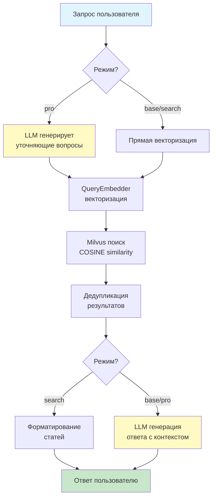
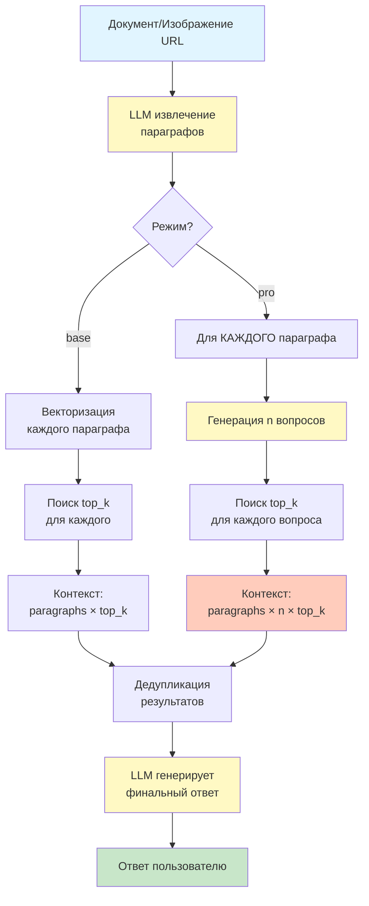

# Law RAG System

[🇬🇧 English version](README.md)

Высокопроизводительная система Retrieval-Augmented Generation (RAG) для поиска по законодательству Кыргызской Республики с интеграцией Telegram-бота.

## ✨ Особенности

- **🔍 Семантический поиск** по юридическим документам с использованием векторных эмбеддингов
- **🤖 Telegram-бот** для удобного взаимодействия с системой
- **📊 Три режима ответа**: 
  - **Базовый** (1 запрос) — быстрый поиск + LLM ответ
  - **Продвинутый** (2 запроса) — расширенный анализ с уточняющими вопросами
  - **Поиск** (1 запрос) — только релевантные статьи без LLM
- **🌐 Поддержка двух языков**: русский и кыргызский
- **📄 Анализ документов** с извлечением структурированных данных:
  - PDF файлы через URL (без base64)
  - Изображения/скриншоты документов
- **⚡ Оптимизированная производительность**: singleton-паттерны, LRU-кэширование, lazy-loading
- **💾 MySQL + Milvus**: хранение пользовательских данных и векторный поиск

## 🏗 Архитектура проекта

```
law-rag-system/
├── aitools/                      # AI инструменты
│   ├── embedder.py              # Singleton-эмбеддер с кэшированием
│   └── llm.py                   # Azure OpenAI клиент (responses API)
├── bot/                          # Telegram-бот
│   ├── bot.py                   # Инициализация и запуск бота
│   ├── handlers.py              # Обработчики сообщений
│   ├── keyboards.py             # Кэшированные клавиатуры
│   ├── messages.py              # Локализованные сообщения
│   └── states.py                # FSM состояния
├── confs/                        # Конфигурация
│   └── config.py                # Переменные окружения + кэшированные промпты
├── databases/                    # Работа с БД
│   ├── db.py                    # MySQL (пользователи, баланс)
│   ├── milvus_db.py             # Milvus (векторный поиск)
│   └── init.sql                 # SQL схема
├── searchers/                    # Логика поиска
│   └── search.py                # ProLawRAGSearch (RAG pipeline)
├── main.py                       # CLI точка входа
├── run_bot.py                    # Запуск Telegram-бота
├── law_rag_db.json              # База законов (RU)
├── law_rag_db_kg.json           # База законов (KG)
├── requirements.txt              # Зависимости
└── .env                          # Переменные окружения
```

## 🚀 Быстрый старт

### 1. Клонирование и настройка

```bash
git clone https://github.com/Hanbiike/law-rag-system.git
cd law-rag-system
python3 -m venv venv
source venv/bin/activate
pip install -r requirements.txt
```

### 2. Настройка `.env`

```env
# Azure OpenAI Nano (используется для всех запросов)
AZURE_ENDPOINT_NANO=https://your-endpoint.openai.azure.com/
AZURE_OPENAI_API_KEY_NANO=your_api_key
AZURE_DEPLOYMENT_NANO=your_deployment_name
AZURE_API_VERSION_NANO=2025-03-01-preview

# Telegram Bot
TELEGRAM_BOT_TOKEN=your_bot_token

# MySQL (опционально, по умолчанию localhost)
DB_HOST=localhost
DB_USER=root
DB_PASSWORD=root
DB_NAME=law_rag_users
DB_PORT=8889
```

### 3. Запуск

**Telegram-бот:**
```bash
python run_bot.py
```

**CLI тестирование:**
```bash
python main.py
```
## 📖 Использование

### Telegram-бот

После запуска бота пользователи могут:
1. Выбрать язык интерфейса (🇷🇺 Русский / 🇰🇬 Кыргызча)
2. Выбрать режим ответа:
   - **📝 Базовый** — поиск + LLM ответ
   - **⚡ Продвинутый** — расширенный анализ с генерацией вопросов
   - **🔍 Поиск** — только релевантные статьи
3. Отправлять текстовые вопросы о законодательстве
4. Загружать PDF документы для анализа
5. Отправлять изображения/скриншоты документов

**Стоимость запросов:**
- **Текстовые запросы:**
  - Базовый режим: 1 запрос
  - Продвинутый режим: 2 запроса
  - Режим поиска: 1 запрос
- **Документы/изображения:**
  - Базовый режим: 3 запроса
  - Продвинутый режим: 9 запросов

### Программный API

```python
from searchers.search import ProLawRAGSearch
import asyncio

# Создание экземпляра (singleton-компоненты переиспользуются)
searcher = ProLawRAGSearch(top_k=3, n_llm_questions=3)

# Текстовый запрос
response = asyncio.run(searcher.get_response_text(
    query="Какие права имеет работник при увольнении?",
    type='pro',     # 'base', 'pro', или 'search'
    lang='ru'       # 'ru' или 'kg'
))

# Анализ PDF документа (через URL)
file_url = "https://api.telegram.org/file/bot<TOKEN>/<file_path>"
response = asyncio.run(searcher.get_response_from_doc_text(
    query="Законен ли данный документ?",
    file_url=file_url,
    type='pro',
    lang='ru'
))

# Анализ изображения документа
image_url = "https://api.telegram.org/file/bot<TOKEN>/<file_path>"
response = asyncio.run(searcher.get_response_from_image_text(
    query="Проанализируй этот документ",
    image_url=image_url,
    type='base',
    lang='ru'
))

```

## ⚡ Оптимизации производительности

### Singleton-паттерны
- `QueryEmbedder` — модель эмбеддингов загружается один раз
- `LLMHelper` — Azure OpenAI клиент переиспользуется
- `MilvusLawSearcher` — соединение с БД переиспользуется

### LRU-кэширование
- Промпты для генерации вопросов (`@lru_cache`)
- Клавиатуры Telegram-бота
- Расчёт стоимости запросов

### Оптимизация токенов
- Сжатые промпты без лишних пробелов
- Системные инструкции вынесены в константы
- Дедупликация результатов поиска
- **Pro режим для документов**: глубокий анализ с расширенным контекстом (до 10×3×3=90 статей)

### Lazy-loading
- Telegram-бот: searcher инициализируется при первом запросе
- Embedder: модель загружается при первом использовании

## 🔧 Компоненты системы

### AI инструменты (`aitools/`)

| Модуль | Описание |
|--------|----------|
| `embedder.py` | Singleton-эмбеддер на базе `google/embeddinggemma-300m`, кэширование, batch processing |
| `llm.py` | Azure OpenAI клиент с responses API (`responses.parse`, `responses.create`). Поддержка файлов/изображений через URL |

### Telegram-бот (`bot/`)

| Модуль | Описание |
|--------|----------|
| `bot.py` | Инициализация aiogram, polling |
| `handlers.py` | Обработчики команд, текста, документов (PDF), изображений |
| `keyboards.py` | Кэшированные inline/reply клавиатуры (3 режима ответа) |
| `messages.py` | Локализованные сообщения (RU/KG) |
| `states.py` | FSM состояния пользователя |

### Базы данных (`databases/`)

| Модуль | Описание |
|--------|----------|
| `db.py` | MySQL: пользователи, баланс, настройки |
| `milvus_db.py` | Milvus: векторный поиск с дедупликацией |

## 🛠 Технические детали

### Процесс RAG-поиска

#### Текстовые запросы



#### Документы/изображения



### Структура данных Milvus

```
law_collection / law_collection_kg
├── source_doc     — название закона
├── section        — раздел
├── chapter        — глава
├── article_title  — название статьи
├── article_text   — текст статьи
└── vector         — эмбеддинг (1024 dim)
```


## 📦 Зависимости

```
openai>=1.0.0           # Azure OpenAI SDK (responses API)
pydantic>=2.0.0         # Валидация данных
pymilvus>=2.3.0         # Векторная БД
sentence-transformers   # Эмбеддинги
mysql-connector-python  # MySQL
aiogram>=3.3.0          # Telegram-бот
python-dotenv           # Переменные окружения
aiofiles                # Async файловые операции
```

## 🐛 Устранение неполадок

| Проблема | Решение |
|----------|---------|
| `Error calling LLM` | Проверьте `.env`, убедитесь что деплой Azure активен |
| `Milvus connection error` | Проверьте наличие `milvus_law_rag.db` |
| `CUDA out of memory` | Модель автоматически переключится на CPU |
| Низкое качество | Увеличьте `top_k`, используйте режим `pro` |
| Режим не сохраняется | Проверьте, что БД поддерживает `'search'` в `response_type` |

## 📊 Производительность

| Операция | Время |
|----------|-------|
| Эмбеддинг запроса | ~0.1-0.3 сек |
| Поиск в Milvus | ~0.01-0.05 сек |
| Генерация ответа LLM | ~1-3 сек |
| Режим 'search' | ~0.2-0.5 сек |
| Полный цикл (base) | ~2-4 сек |
| Полный цикл (pro) | ~4-7 сек |
| **Документ base** | ~5-10 сек |
| **Документ pro** | ~15-30 сек (глубокий анализ) |

## 🔒 Безопасность

- ⚠️ Никогда не коммитьте `.env` в git
- Используйте ротацию API-ключей
- Конфигурация БД через переменные окружения
- Валидация размера документов:
  - PDF: макс. 20 МБ
  - Изображения: макс. 10 МБ
- Поддерживаемые форматы: PDF, JPEG, PNG, GIF, WebP

## 🗺 Roadmap

- [x] Telegram-бот с FSM
- [x] Три режима ответа (base, pro, search)
- [x] Поддержка изображений/скриншотов
- [x] Работа с файлами через URL (без base64)
- [x] Singleton-оптимизации
- [x] LRU-кэширование
- [x] Дедупликация результатов
- [ ] Redis для кэширования ответов
- [ ] Web интерфейс (FastAPI)
- [ ] Поддержка DOCX документов
- [ ] A/B тестирование моделей
- [ ] Статистика использования режимов

## 📄 Лицензия

GNU General Public License v3.0 (GPL-3.0)

Это свободное программное обеспечение: вы можете распространять и/или изменять его в соответствии с условиями GNU General Public License версии 3, опубликованной Free Software Foundation.

Основные условия:
- ✅ Коммерческое использование
- ✅ Модификация
- ✅ Распространение
- ✅ Патентное использование
- ✅ Частное использование
- ❗ Раскрытие исходного кода (copyleft)
- ❗ Указание лицензии и авторских прав
- ❗ Указание изменений
- ❗ Использование той же лицензии

См. [LICENSE](LICENSE) для полного текста лицензии.

## 👤 Автор

**Askat Rakhymbekov** ([@Hanbiike](https://github.com/Hanbiike))

## 🙏 Благодарности

- Azure OpenAI — LLM модели
- Milvus — векторная база данных
- SentenceTransformers — эмбеддинги
- aiogram — Telegram-бот фреймворк