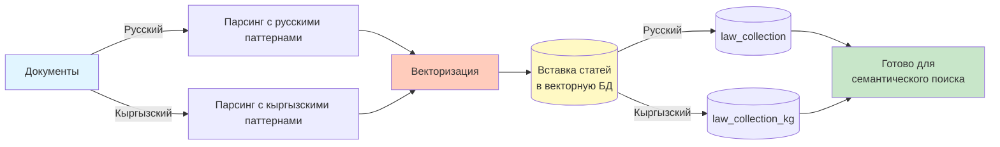
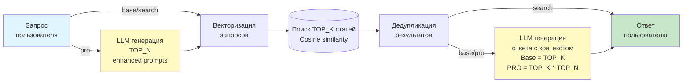
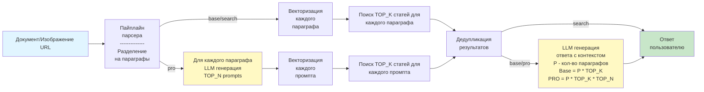
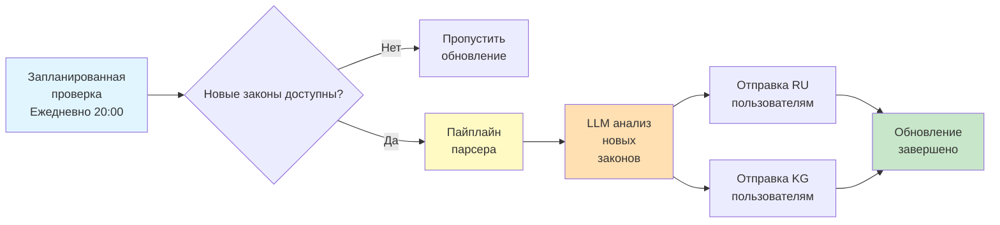

# Law RAG System

[🇬🇧 English version](README.md)

Высокопроизводительная система Retrieval-Augmented Generation (RAG) для поиска по законодательству Кыргызской Республики с интеграцией Telegram-бота.

## ✨ Особенности

- **🔍 Семантический поиск** по юридическим документам с использованием векторных эмбеддингов
- **🤖 Telegram-бот** для удобного взаимодействия с системой
- **📊 Три режима ответа**: 
  - **Базовый** (1 запрос) — быстрый поиск + LLM ответ
  - **Продвинутый** (2 запроса) — расширенный анализ с уточняющими вопросами
  - **Поиск** (1 запрос) — только релевантные статьи без LLM
- **🌐 Веб-фронтенд (Next.js 16)** со стримингом ответов, анализом файлов, темами и голосовым режимом
- **🧩 REST API (FastAPI)**: все режимы доступны по HTTP со Swagger UI
- **🚀 Единый запуск**: `run_service.py` поднимает backend + frontend и в dev, и в prod
- **💬 История чата**: поддержка `previous_response_id` для многоэтапных диалогов
- **🌐 Поддержка двух языков**: русский и кыргызский
- **📄 Анализ документов** с извлечением структурированных данных:
  - PDF файлы через URL (без base64)
  - Изображения/скриншоты документов
- **⚡ Оптимизированная производительность**: singleton-паттерны, LRU-кэширование, lazy-loading
- **💾 MySQL + Milvus**: хранение пользовательских данных и векторный поиск

## 🏗 Архитектура проекта

```
law-rag-system/
├── aitools/                      # AI инструменты
│   ├── embedder.py              # Singleton-эмбеддер с кэшированием
│   └── llm.py                   # Azure OpenAI клиент (responses API)
├── bot/                          # Telegram-бот
│   ├── bot.py                   # Инициализация и запуск бота
│   ├── handlers.py              # Обработчики сообщений
│   ├── keyboards.py             # Кэшированные клавиатуры
│   ├── messages.py              # Локализованные сообщения
│   └── states.py                # FSM состояния
├── confs/                        # Конфигурация
│   └── config.py                # Переменные окружения + кэшированные промпты
├── databases/                    # Работа с БД
│   ├── db.py                    # MySQL (пользователи, баланс)
│   ├── milvus_db.py             # Milvus (векторный поиск)
│   ├── milvus_init.py           # Инициализация Milvus
│   └── init.sql                 # SQL схема
├── parser/                       # Парсинг документов (ООП)
│   ├── document_parser.py       # DocumentParser (поддержка RU/KG)
│   ├── vectorizer.py            # Vectorizer (эмбеддинги)
│   ├── milvus_loader.py         # MilvusLoader (загрузка данных)
│   ├── pipeline.py              # ParserPipeline (полный процесс)
│   ├── docx/                    # Русские DOCX файлы
│   └── docx_kg/                 # Киргизские DOCX файлы
├── searchers/                    # Логика поиска
│   └── search.py                # ProLawRAGSearch (RAG pipeline)
├── api/                          # FastAPI-приложение
│   ├── __init__.py
│   └── app.py                   # Эндпоинты: /v1/query, /v1/query/doc, /v1/query/image
├── frontend/                     # Next.js веб-фронтенд
│   ├── src/app/                 # App Router страницы и API routes
│   ├── src/components/          # Chat UI, markdown, темы, voice chat
│   └── package.json             # Зависимости и скрипты фронтенда
├── main.py                       # CLI точка входа
├── run_bot.py                    # Запуск Telegram-бота
├── run_api.py                    # Запуск FastAPI-сервера
├── run_service.py                # Единый запуск backend + frontend
├── law_rag_db.json              # База законов (RU)
├── law_rag_db_kg.json           # База законов (KG)
├── .env.example                  # Полный шаблон переменных окружения
├── requirements.txt              # Зависимости
└── .env                          # Переменные окружения
```

## 🚀 Быстрый старт

### 1. Клонирование и установка зависимостей

Требования:

- Python 3.10+
- Node.js 20+
- npm 10+

```bash
git clone https://github.com/Hanbiike/law-rag-system.git
cd law-rag-system
python3 -m venv venv
source venv/bin/activate
pip install -r requirements.txt
cd frontend
npm install
cd ..
```

Если нужен только backend или Telegram-бот, установку фронтенда можно пропустить.

### 2. Создание `.env` из `.env.example`

```bash
cp .env.example .env
```

В репозитории теперь есть полный шаблон [.env.example](.env.example). Основные переменные:

```env
# Azure OpenAI основной deployment
AZURE_ENDPOINT=https://your-resource.openai.azure.com/
AZURE_OPENAI_API_KEY=your_primary_api_key
AZURE_DEPLOYMENT=your_primary_deployment
AZURE_API_VERSION=2025-03-01-preview

# Azure OpenAI Nano (роутинг / расширение запросов)
AZURE_ENDPOINT_NANO=https://your-endpoint.openai.azure.com/
AZURE_OPENAI_API_KEY_NANO=your_api_key
AZURE_DEPLOYMENT_NANO=your_deployment_name
AZURE_API_VERSION_NANO=2025-03-01-preview

# Telegram Bot
TELEGRAM_BOT_TOKEN=your_bot_token

# MySQL (опционально, по умолчанию localhost)
DB_HOST=localhost
DB_USER=root
DB_PASSWORD=root
DB_NAME=law_rag_users
DB_PORT=3306

# Локальные серверы
API_HOST=0.0.0.0
API_PORT=8000
API_WORKERS=1
FRONTEND_PORT=3000
LAW_RAG_API_URL=http://127.0.0.1:8000
NEXT_PUBLIC_DEFAULT_THEME=
```

### 3. Настройка MySQL

**Установка MySQL:**

```bash
# macOS
brew install mysql
brew services start mysql

# Ubuntu/Debian
sudo apt update
sudo apt install mysql-server
sudo systemctl start mysql

# Windows
# Скачайте и установите с https://dev.mysql.com/downloads/mysql/
```

**Создание базы данных и пользователя:**

```bash
# Подключение к MySQL
mysql -u root -p
```

```sql
-- Создание базы данных
CREATE DATABASE law_rag_users CHARACTER SET utf8mb4 COLLATE utf8mb4_unicode_ci;

-- Создание пользователя (измените пароль)
CREATE USER 'law_rag_user'@'localhost' IDENTIFIED BY 'ваш_надежный_пароль';

-- Предоставление прав
GRANT ALL PRIVILEGES ON law_rag_users.* TO 'law_rag_user'@'localhost';
FLUSH PRIVILEGES;

-- Выход
EXIT;
```

**Инициализация схемы:**

```bash
# Импорт схемы базы данных
mysql -u law_rag_user -p law_rag_users < databases/init.sql
```

**Обновите `.env` вашими данными:**

```env
DB_HOST=localhost
DB_USER=law_rag_user
DB_PASSWORD=ваш_надежный_пароль
DB_NAME=law_rag_users
DB_PORT=3306
```

### 4. Запуск

**Рекомендуемый вариант: backend + frontend вместе**
```bash
python run_service.py

# Frontend:  http://localhost:3000
# Backend:   http://localhost:8000/docs

# Production режим (сборка фронтенда и запуск standalone-сервера)
python run_service.py --mode prod

# Только frontend или только backend
python run_service.py --no-backend
python run_service.py --no-frontend

# Кастомные порты
python run_service.py --frontend-port 3001 --api-port 8080
```

В dev-режиме фронтенд запускается через `next dev --webpack`. В prod-режиме `run_service.py` собирает Next.js-приложение, запускает standalone-сервер и автоматически подготавливает нужные статические ассеты.

**Telegram-бот:**
```bash
python run_bot.py
```

**Только FastAPI-сервер:**
```bash
python run_api.py
# Swagger UI: http://localhost:8000/docs

# Кастомный хост/порт
python run_api.py --host 0.0.0.0 --port 8080

# Режим разработки с автоперезагрузкой
python run_api.py --reload
```

**CLI тестирование:**
```bash
python main.py
```
## 📖 Использование

### REST API (FastAPI)

HTTP API предоставляет все режимы поиска и поддерживает историю диалога через `previous_response_id`.

#### Эндпоинты

| Метод | Путь | Описание |
|--------|------|-------------|
| `GET` | `/health` | Проверка доступности |
| `POST` | `/v1/query` | Текстовый запрос (`base` / `pro` / `search`) |
| `POST` | `/v1/query/doc` | Анализ PDF по URL (`base` / `pro`) |
| `POST` | `/v1/query/image` | Анализ изображения / скриншота по URL (`base` / `pro`) |

#### Текстовый запрос

```bash
curl -X POST http://localhost:8000/v1/query \
  -H "Content-Type: application/json" \
  -d '{
    "query": "Какие права имеет работник при увольнении?",
    "type": "pro",
    "lang": "ru"
  }'
```

Ответ:
```json
{
  "response": "Согласно статье 83 Трудового кодекса...",
  "response_id": "resp_abc123",
  "mode": "pro",
  "lang": "ru"
}
```

#### Многоэтапный диалог (история чата)

Передайте `response_id` из предыдущего ответа как `previous_response_id` в следующем запросе:

```bash
curl -X POST http://localhost:8000/v1/query \
  -H "Content-Type: application/json" \
  -d '{
    "query": "Какие исключения предусмотрены?",
    "type": "pro",
    "lang": "ru",
    "previous_response_id": "resp_abc123"
  }'
```

#### Анализ PDF-документа

```bash
curl -X POST http://localhost:8000/v1/query/doc \
  -H "Content-Type: application/json" \
  -d '{
    "query": "Легален ли данный договор?",
    "file_url": "https://example.com/contract.pdf",
    "type": "base",
    "lang": "ru"
  }'
```

#### Анализ изображения / скана

```bash
curl -X POST http://localhost:8000/v1/query/image \
  -H "Content-Type: application/json" \
  -d '{
    "query": "Проверь документ на соответствие законодательству",
    "image_url": "https://example.com/scan.jpg",
    "type": "base",
    "lang": "ru"
  }'
```

Интерактивная документация доступна по адресу **http://localhost:8000/docs** (Swagger UI) и **http://localhost:8000/redoc**.

---

### Telegram-бот

После запуска бота пользователи могут:
1. Выбрать язык интерфейса (🇷🇺 Русский / 🇰🇬 Кыргызча)
2. Выбрать режим ответа:
   - **📝 Базовый** — поиск + LLM ответ
   - **⚡ Продвинутый** — расширенный анализ с генерацией вопросов
   - **🔍 Поиск** — только релевантные статьи
3. Отправлять текстовые вопросы о законодательстве
4. Загружать PDF документы для анализа
5. Отправлять изображения/скриншоты документов

**Стоимость запросов:**
- **Текстовые запросы:**
  - Базовый режим: 1 запрос
  - Продвинутый режим: 2 запроса
  - Режим поиска: 1 запрос
- **Документы/изображения:**
  - Базовый режим: 3 запроса
  - Продвинутый режим: 9 запросов

### Программный API (Python)

```python
from searchers.search import ProLawRAGSearch
import asyncio

# Создание экземпляра (singleton-компоненты переиспользуются)
searcher = ProLawRAGSearch(top_k=3, n_llm_questions=3)

# Текстовый запрос — возвращает (text, response_id)
text, response_id = asyncio.run(searcher.get_response_text(
    query="Какие права имеет работник при увольнении?",
    type='pro',                    # 'base', 'pro', или 'search'
    lang='ru',                     # 'ru' или 'kg'
    previous_response_id=None      # передайте response_id для продолжения диалога
))

# Продолжение диалога
text2, response_id2 = asyncio.run(searcher.get_response_text(
    query="Какие исключения предусмотрены?",
    type='pro',
    lang='ru',
    previous_response_id=response_id   # передаём response_id предыдущего ответа
))

# Анализ PDF-документа (через URL)
text, response_id = asyncio.run(searcher.get_response_from_doc_text(
    query="Законен ли данный документ?",
    file_url="https://example.com/document.pdf",
    type='pro',
    lang='ru'
))

# Анализ изображения документа
text, response_id = asyncio.run(searcher.get_response_from_image_text(
    query="Проанализируй этот документ",
    image_url="https://example.com/scan.jpg",
    type='base',
    lang='ru'
))
```

## ⚡ Оптимизации производительности

### Singleton-паттерны
- `QueryEmbedder` — модель эмбеддингов загружается один раз
- `LLMHelper` — Azure OpenAI клиент переиспользуется
- `MilvusLawSearcher` — соединение с БД переиспользуется

### LRU-кэширование
- Промпты для генерации вопросов (`@lru_cache`)
- Клавиатуры Telegram-бота
- Расчёт стоимости запросов

### Оптимизация токенов
- Сжатые промпты без лишних пробелов
- Системные инструкции вынесены в константы
- Дедупликация результатов поиска
- **Pro режим для документов**: глубокий анализ с расширенным контекстом (до 10×3×3=90 статей)

### Lazy-loading
- Telegram-бот: searcher инициализируется при первом запросе
- Embedder: модель загружается при первом использовании

## 📚 Парсинг документов и настройка БД

### Пайплайн парсера

Система включает полный ООП-пайплайн для обработки юридических документов:


```mermaid
flowchart LR
    A["Документы"] -- Русский --> D1["Парсинг с русскими паттернами"]
    A -- Кыргызский --> D2["Парсинг с кыргызскими паттернами"]
    D1 --> G["Векторизация"]
    D2 --> G
    G --> L[("Вставка статей<br>в векторную БД")]
    L -- Русский --> N1[("law_collection")]
    L -- Кыргызский --> N2[("law_collection_kg")]
    N1 --> O["Готово для<br>семантического поиска"]
    N2 --> O

    style A fill:#e1f5ff
    style G fill:#ffccbc
    style L fill:#fff9c4
    style O fill:#c8e6c9
```

```python
# Полный пайплайн (парсинг DOCX → векторизация → загрузка в Milvus)
from parser import ParserPipeline, PipelineConfig

config = PipelineConfig(
    ru_input_dir="parser/docx",
    kg_input_dir="parser/docx_kg",
    milvus_db_path="milvus_law_rag.db"
)

pipeline = ParserPipeline(config)
pipeline.process_all()  # Обработка русских и киргизских документов
```

### Использование отдельных компонентов

```python
from parser import DocumentParser, Language, Vectorizer, MilvusLoader

# 1. Парсинг DOCX файлов
parser = DocumentParser(Language.RUSSIAN, "parser/docx")
articles = parser.parse_directory(save_jsonl=True)

# 2. Векторизация статей
vectorizer = Vectorizer()
vectorized = vectorizer.vectorize_articles(articles)
vectorizer.save_to_json(vectorized, "law_rag_db.json")

# 3. Загрузка в Milvus
loader = MilvusLoader()
loader.setup_language_collection(Language.RUSSIAN, vectorized)
```

### Инициализация Milvus

```bash
# Загрузка из существующих JSON файлов
python -m databases.milvus_init --from-json

# Полный пайплайн (парсинг + векторизация + загрузка)
python -m databases.milvus_init --full-pipeline

# С пользовательскими путями
python -m databases.milvus_init --from-json \
  --ru-json law_rag_db.json \
  --kg-json law_rag_db_kg.json \
  --db-path milvus_law_rag.db
```

## 🔧 Компоненты системы

### AI инструменты (`aitools/`)

| Модуль | Описание |
|--------|----------|
| `embedder.py` | Singleton-эмбеддер на базе `google/embeddinggemma-300m`, кэширование, batch processing |
| `llm.py` | Azure OpenAI клиент с responses API (`responses.parse`, `responses.create`). Поддержка файлов/изображений через URL. Возвращает `(text, response_id)` для поддержки истории чата. |

### FastAPI (`api/`)

| Модуль | Описание |
|--------|----------|
| `app.py` | FastAPI-приложение. Три эндпоинта: `/v1/query`, `/v1/query/doc`, `/v1/query/image`. Полная поддержка `previous_response_id`. Swagger UI по адресу `/docs`. |

### Telegram-бот (`bot/`)

| Модуль | Описание |
|--------|----------|
| `bot.py` | Инициализация aiogram, polling |
| `handlers.py` | Обработчики команд, текста, документов (PDF), изображений |
| `keyboards.py` | Кэшированные inline/reply клавиатуры (3 режима ответа) |
| `messages.py` | Локализованные сообщения (RU/KG) |
| `states.py` | FSM состояния пользователя |

### Базы данных (`databases/`)

| Модуль | Описание |
|--------|----------|
| `db.py` | MySQL: пользователи, баланс, настройки |
| `milvus_db.py` | Milvus: векторный поиск с дедупликацией |
| `milvus_init.py` | Инициализация Milvus из JSON или полного пайплайна |

### Парсер документов (`parser/`)

| Модуль | Описание |
|--------|----------|
| `document_parser.py` | ООП-парсер DOCX с поддержкой русского/киргизского. Использует `Language` enum и `PatternFactory` для языковых паттернов |
| `vectorizer.py` | Векторизация с SentenceTransformer. Batch processing, lazy-loading, сохранение/загрузка JSON |
| `milvus_loader.py` | Загрузка векторизованных статей в Milvus. Управление коллекциями, маршрутизация по языку |
| `pipeline.py` | End-to-end пайплайн: парсинг → векторизация → загрузка. Поддержка полного процесса или только JSON |

## 🛠 Технические детали

### Процесс RAG-поиска

#### Текстовые запросы


```mermaid
flowchart LR
    A[Запрос<br/>пользователя]
    A -->|pro| C[LLM генерация<br/>TOP_N<br/>enhanced prompts]
    A -->|base/search| E
    C --> E[Векторизация<br/> запросов]
    E --> F[(Поиск TOP_K статей<br/>Cosine similarity)]
    F --> G[Дедупликация<br/>результатов]
    G --> |search| K[Форматирование<br/>статей]
    G -->|base/pro| J[LLM генерация<br/>ответа с контекстом<br/>Base = TOP_K<br/>PRO = TOP_K * TOP_N]
    J --> K[Ответ<br/>пользователю]
    
    style A fill:#e1f5ff
    style K fill:#c8e6c9
    style C fill:#fff9c4
    style J fill:#fff9c4
```

#### Документы/изображения


```mermaid
flowchart LR
    A["Документ/Изображение URL"] --> B["Пайплайн<br>парсера<br>--------------<br>Разделение<br>на параграфы"]
    B -- base/search --> D1["Векторизация<br>каждого<br>параграфа"]
    D1 --> D2["Поиск TOP_K статей для<br> каждого параграфа"] --> G
    B -- pro --> E1["Для каждого параграфа<br>LLM генерация<br>TOP_N prompts"]
    E1 --> E2["Векторизация<br>каждого<br>промпта"]
    E2 --> E3["Поиск TOP_K статей для<br> каждого промпта"] --> G["Дедупликация<br>результатов"]
    
    G -- search --> K["Ответ<br>пользователю"]
    G -- base/pro --> J["LLM генерация<br>ответа с контекстом<br>P - кол-во параграфов<br>Base = P * TOP_K<br>PRO = P * TOP_K * TOP_N"]
    J --> K

    style A fill:#e1f5ff
    style E1 fill:#FFF9C4
    style K fill:#c8e6c9
    style J fill:#fff9c4
```

### Структура данных Milvus

```
law_collection / law_collection_kg
├── source_doc     — название закона
├── section        — раздел
├── chapter        — глава
├── article_title  — название статьи
├── article_text   — текст статьи
└── vector         — эмбеддинг (1024 dim)
```


## 📦 Зависимости

```
openai>=1.0.0           # Azure OpenAI SDK (responses API)
pydantic>=2.0.0         # Валидация данных
pymilvus>=2.3.0         # Векторная БД
sentence-transformers   # Эмбеддинги
mysql-connector-python  # MySQL
aiogram>=3.3.0          # Telegram-бот
python-dotenv           # Переменные окружения
aiofiles                # Async файловые операции
fastapi>=0.110.0        # REST API фреймворк
uvicorn[standard]>=0.29.0  # ASGI-сервер
```

## 🐛 Устранение неполадок

| Проблема | Решение |
|----------|---------|
| `Error calling LLM` | Проверьте `.env`, убедитесь что деплой Azure активен |
| `Milvus connection error` | Проверьте наличие `milvus_law_rag.db` |
| `CUDA out of memory` | Модель автоматически переключится на CPU |
| Низкое качество | Увеличьте `top_k`, используйте режим `pro` |
| Режим не сохраняется | Проверьте, что БД поддерживает `'search'` в `response_type` |
| `EADDRINUSE` при запуске | Смените порт через `--frontend-port` / `--api-port` или остановите конфликтующий процесс |
| Фронтенд в dev работает, а в prod «разваливается» | Запускайте через `python run_service.py --mode prod`; скрипт сам подготавливает статические ассеты для Next.js standalone |
| `Can't resolve 'tailwindcss'` в dev-режиме фронтенда | Запускайте проект через `python run_service.py` или стартуйте фронтенд как `next dev --webpack` |

## 📊 Производительность

| Операция | Время |
|----------|-------|
| Эмбеддинг запроса | ~0.1-0.3 сек |
| Поиск в Milvus | ~0.01-0.05 сек |
| Генерация ответа LLM | ~1-3 сек |
| Режим 'search' | ~0.2-0.5 сек |
| Полный цикл (base) | ~2-4 сек |
| Полный цикл (pro) | ~4-7 сек |
| **Документ base** | ~5-10 сек |
| **Документ pro** | ~15-30 сек (глубокий анализ) |

### Метрики оценки RAG


## 🔒 Безопасность

- ⚠️ Никогда не коммитьте `.env` в git
- Используйте ротацию API-ключей
- Конфигурация БД через переменные окружения
- Валидация размера документов:
  - PDF: макс. 20 МБ
  - Изображения: макс. 10 МБ
- Поддерживаемые форматы: PDF, JPEG, PNG, GIF, WebP

## 🔄 Пайплайн автообновления

### Ежедневное обновление законов (В разработке)

Автоматизированный пайплайн для мониторинга и обновления базы законов:


```mermaid
flowchart LR
    A[Запланированная<br/>проверка<br/>Ежедневно 20:00] --> B{Новые законы доступны?}
    
    B -->|Нет| C[Пропустить<br/>обновление]
    B -->|Да| E[Пайплайн<br/>парсера]
    
    
    E --> L[LLM анализ<br/>новых<br/>законов]
    
    L --> M1[Отправка RU<br/>пользователям]
    L --> M2[Отправка KG<br/>пользователям]
    
    M1 --> O
    M2 --> O[Обновление<br/>завершено]
    
    style A fill:#e1f5ff
    style O fill:#c8e6c9
    style E fill:#fff9c4
    style L fill:#ffe0b2
```

**Возможности:**
- 🕐 Запланированные ежедневные проверки новых законов
- 📥 Автоматическое скачивание документов из официальных источников
- 🔍 Интеллектуальное обнаружение изменений
- ⚡ Инкрементальные обновления (только новые статьи)
- 🤖 **LLM-анализ и создание сводок новых законов**
- 📢 **Автоматическая рассылка уведомлений через Telegram-бот**
- 💬 **Персонализированные объяснения на языке пользователя (RU/KG)**
- 📊 Логи обновлений и статистика
- 🔄 Обновления без простоя
- 🌐 Поддержка нескольких языков (RU/KG)

## 🗺 Roadmap

- [x] Telegram-бот с FSM
- [x] Три режима ответа (base, pro, search)
- [x] Поддержка изображений/скриншотов
- [x] Работа с файлами через URL (без base64)
- [x] Singleton-оптимизации
- [x] LRU-кэширование
- [x] Дедупликация результатов
- [x] ООП-парсер документов
- [x] **REST API (FastAPI) со всеми режимами поиска**
- [x] **История чата через `previous_response_id`**
- [ ] **Автоматизированный пайплайн ежедневных обновлений законов** 🚧
- [ ] Redis для кэширования ответов
- [ ] Поддержка DOCX документов
- [ ] A/B тестирование моделей
- [ ] Статистика использования режимов

## 📄 Лицензия

GNU General Public License v3.0 (GPL-3.0)

Это свободное программное обеспечение: вы можете распространять и/или изменять его в соответствии с условиями GNU General Public License версии 3, опубликованной Free Software Foundation.

Основные условия:
- ✅ Коммерческое использование
- ✅ Модификация
- ✅ Распространение
- ✅ Патентное использование
- ✅ Частное использование
- ❗ Раскрытие исходного кода (copyleft)
- ❗ Указание лицензии и авторских прав
- ❗ Указание изменений
- ❗ Использование той же лицензии

См. [LICENSE](LICENSE) для полного текста лицензии.

## 👤 Автор

**Askat Rakhymbekov** ([@Hanbiike](https://github.com/Hanbiike))

## 🙏 Благодарности

- [blrchen/chatgpt-lite](https://github.com/blrchen/chatgpt-lite) — основа фронтенда веб-интерфейса
- Azure OpenAI — LLM модели
- Milvus — векторная база данных
- SentenceTransformers — эмбеддинги
- aiogram — Telegram-бот фреймворк