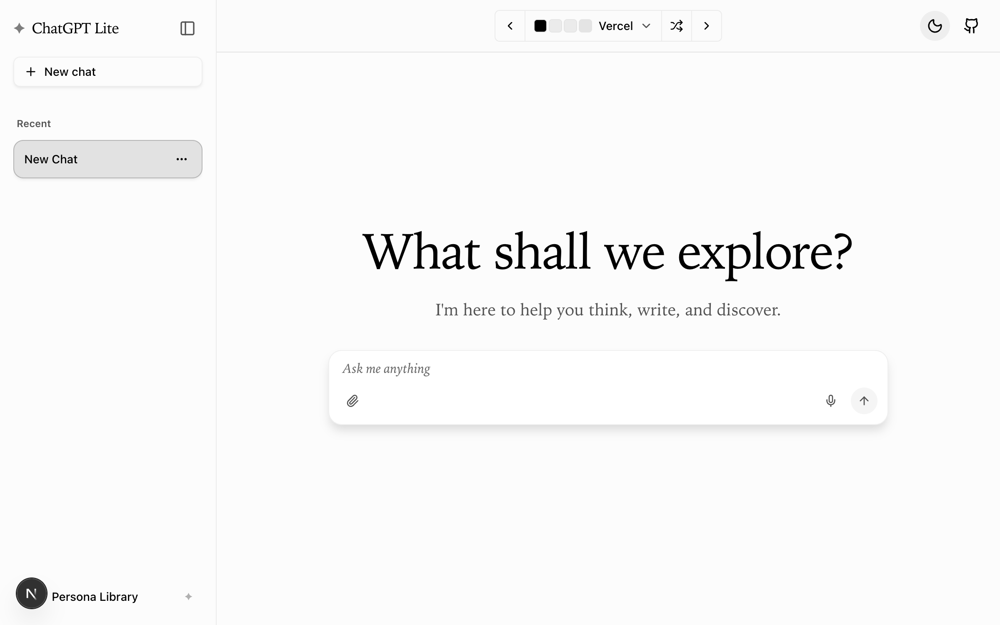
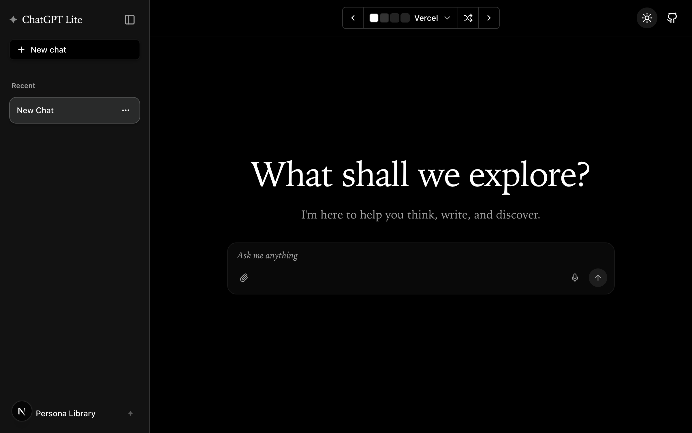

# Law RAG Frontend

English | [简体中文](./README.zh-CN.md)

This directory contains the Next.js 16 web frontend used by the Law RAG System.
It is based on ChatGPT Lite, but is integrated with the Law RAG FastAPI backend
instead of calling OpenAI or Azure OpenAI directly from the frontend.

For full project setup and the recommended combined startup flow, see
[../README.md](../README.md) or [../README.ru.md](../README.ru.md).

## Demo

Try the [ChatGPT Lite Demo Site](https://gptlite.vercel.app).




## Features

This frontend is a Law RAG web client built with Next.js 16. It talks to the
Law RAG FastAPI backend and provides a browser chat interface for legal search,
streaming answers, and document analysis.

**Core Features:**

- **Real-time Streaming Responses** - Instant token-by-token output via Edge Runtime and Server-Sent Events
- **Rich Markdown Rendering** - Full markdown support with syntax highlighting and KaTeX math equations
- **Law RAG Modes** - Switch between `base`, `pro`, and `search` modes from the UI
- **Persistent Chat History** - All conversations saved locally with no database required
- **Law RAG Backend Integration** - Uses the backend API via `LAW_RAG_API_URL`
- **File Attachments** - Upload images, PDFs, spreadsheets (XLSX/CSV), and text files directly in chat
- **Voice Input** - Dictate messages using Web Speech API with continuous recognition
- **Document/Image Analysis** - Send PDF URLs and screenshots to the backend for legal analysis

**User Experience:**

- **Responsive Design** - Mobile-first interface with collapsible sidebar, optimized for all screen sizes
- **40+ Built-in Themes** - Extensive theme library with light, dark, and colorful options
- **Multi-conversation Management** - Organize and switch between multiple chat threads
- **Privacy-focused** - Host your own instance without exposing API keys to end users

**Developer Experience:**

- Built with **Next.js 16 App Router**, **React 19**, and **Tailwind CSS v4**
- **Vercel AI SDK** (`@ai-sdk/react`) for streaming chat with UI message protocol
- Clean, extensible architecture using **Shadcn/ui** components and **Radix UI** primitives
- Easy deployment to Vercel, Docker, or any Node.js environment

If you’re looking for a more beginner-friendly ChatGPT UI codebase, check out [ChatGPT Minimal](https://github.com/blrchen/chatgpt-minimal).

## Prerequisites

- Node.js 20+
- npm 10+
- A running Law RAG backend (`run_api.py` or `run_service.py`)

## Deployment

Refer to the [Environment Variables](#environment-variables) section below for the required configuration.

### Recommended local production run

From the repository root:

```bash
python run_service.py --mode prod
```

This builds the frontend, prepares the Next.js standalone output, and starts
the production server together with the backend.

### Frontend-only production run

If you need to run the frontend separately from this directory:

```bash
npm install
npm run build
PORT=3000 HOSTNAME=0.0.0.0 LAW_RAG_API_URL=http://127.0.0.1:8000 node .next/standalone/server.js
```

If you launch the standalone server manually outside `run_service.py`, make
sure `public/` and `.next/static/` are available next to `.next/standalone/server.js`.

## Development

### Running Locally

Recommended: start the whole project from the repository root:

```bash
python run_service.py
```

Frontend-only development from this directory:

1. Install dependencies using `npm install`.
2. Ensure the backend is running on `http://127.0.0.1:8000` or set `LAW_RAG_API_URL`.
3. Start the application with `npm run dev -- --webpack`.
4. Open `http://localhost:3000` in your browser.

## Environment Variables

The frontend uses the following environment variables:

| Name | Description | Default Value |
| ---- | ----------- | ------------- |
| `LAW_RAG_API_URL` | Base URL of the Law RAG FastAPI backend used by server routes and SSR calls. | `http://localhost:8000` |
| `NEXT_PUBLIC_DEFAULT_THEME` | Optional default UI theme preset. | empty |
| `PORT` | Port used by the standalone production server. | `3000` |
| `HOSTNAME` | Bind host used by the standalone production server. | `0.0.0.0` |

In the repository root, these values are typically configured through
[../.env.example](../.env.example) and started via `run_service.py`.

## Acknowledgments

- Theme configurations from [tweakcn](https://github.com/jnsahaj/tweakcn)

## Contribution

PRs of all sizes are welcome.
